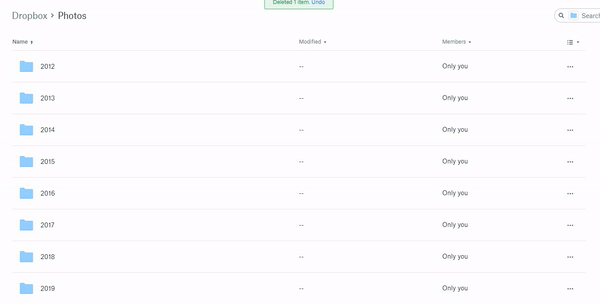

# FileSort

FileSort is a tool for classifying files based on date(other classifiers coming soon).
I made this tool for sorting the photos from my Dropbox "Camera Uploads" folder. Usually that folder gets pretty big and I like to have my photos organized in the following structure

<pre>
|Root folder
├── year
│   └── month
│       └── day
│         └── pic1.jpg
│         └── pic2.jpg
</pre>

Here's how my Dropbox looks:

# Usage

## Install the tool

`dotnet tool install --global file-sort`

## Options:
<pre>
-r|--recursive                              Recursive search
-d|--working-directory <WORKING_DIRECTORY>                     The directory to search
-u|--use-multiple-classifiers               Use multiple classifiers
-i|--interval <INTERVAL>                              year/month/day/hour
-m|--move-to-root                           Move all files to root
-?|-h|--help                                Show help information
</pre>

## Examples:

### Sort all files by month: 
`file-sort -i=month`

### Sort all files from every subfolder by day: 

`file-sort -i=day -r`

### Sort all files from every subfolder by day, month, year: 

`file-sort -i=day -u -i`

### Move every file from every subfolder to the current folder:

`file-sort -m`

